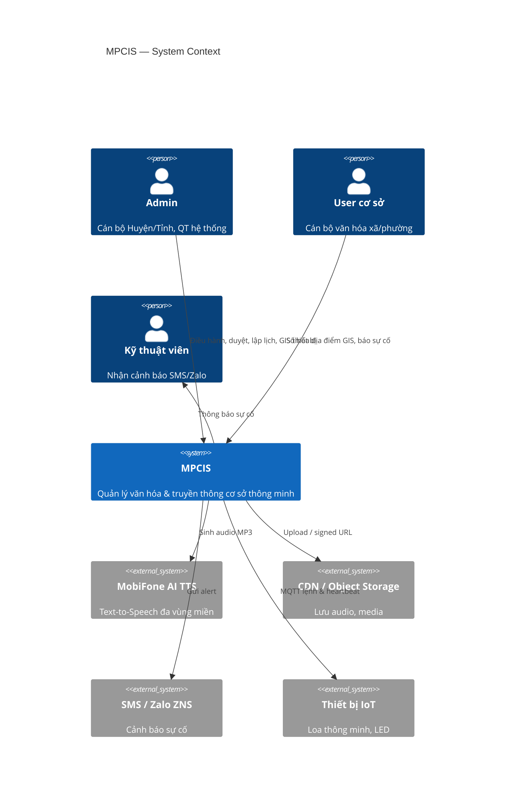
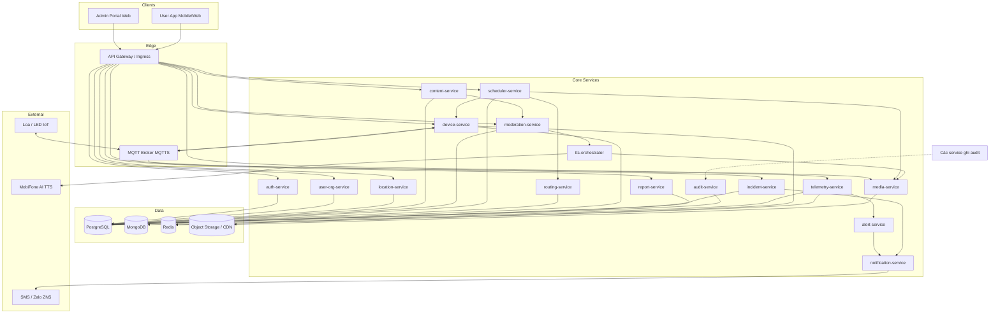
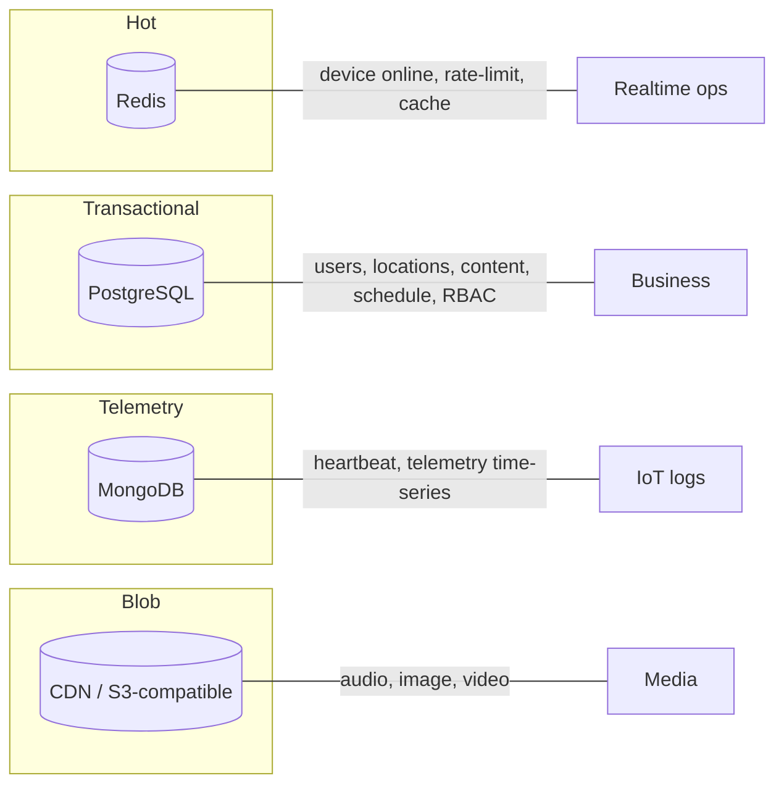

# MPCIS — Sơ đồ Kiến trúc & Service

> Phiên bản: 1.0 · Dựa trên đặc tả `MPCIS_HeThongQuanLyVanHoa_ChiTiet.md`

---

## 1. Mục tiêu kiến trúc

- Scale theo số thiết bị IoT (hàng nghìn loa/LED) và số đơn vị hành chính.
- Tách rõ **ba luồng**: (1) **GIS Asset** — User số hóa địa điểm/tài sản; (2) **Nội dung phát thanh** — Admin CMS + duyệt + TTS; (3) **Thiết bị** — MQTT + telemetry + điều khiển.
- Đảm bảo nội dung chỉ phát khi có chữ ký/duyệt từ Admin hợp lệ.
- Hỗ trợ 2 client: Admin Portal (Web) và User App (Mobile/Web).

---

## 2. Sơ đồ kiến trúc tổng thể (C4 Context)

### Sơ đồ logical (Deployment view đơn giản)

---

## 3. Danh mục Microservices

| # | Service | Trách nhiệm | Protocol | DB chính |
|---|---------|-------------|----------|----------|
| 1 | **auth-service** | Đăng nhập, JWT/OAuth2, refresh token, session | HTTPS | PostgreSQL |
| 2 | **user-org-service** | User, Role, Org theo địa giới (Tỉnh/Huyện/Xã), RBAC | HTTPS | PostgreSQL |
| 3 | **location-service** | CRUD địa điểm/tài sản GIS, GeoJSON, giấy phép, ảnh hiện trạng | HTTPS | PostgreSQL |
| 4 | **content-service** | CRUD tin/bài phát thanh (Admin), media metadata | HTTPS | PostgreSQL |
| 5 | **moderation-service** | Duyệt / từ chối / yêu cầu sửa, state machine nội dung | HTTPS | PostgreSQL |
| 6 | **tts-orchestrator** | Gọi AI TTS, cấu hình giọng/vùng/tốc độ/nhạc nền | HTTPS + Queue | PostgreSQL |
| 7 | **media-service** | Upload ảnh location + audio CDN, chữ ký số, DRM cơ bản | HTTPS | Object Storage + PG meta |
| 8 | **scheduler-service** | Chiến dịch, lịch định kỳ, phát ngay (live/emergency) | HTTPS + Cron/Worker | PostgreSQL |
| 9 | **routing-service** | Mapping nội dung → cụm thiết bị / địa bàn | HTTPS | PostgreSQL |
| 10 | **device-service** | Đăng ký thiết bị IoT, điều khiển remote, online status | HTTPS + MQTT | PostgreSQL + Redis |
| 11 | **telemetry-service** | Heartbeat, log telemetry, detect offline | MQTT ingest | MongoDB + Redis |
| 12 | **alert-service** | Rule cảnh báo, escalate GIS/SMS/Zalo | Internal | PostgreSQL |
| 13 | **incident-service** | Báo sự cố từ User (ảnh, mô tả), ticket bảo trì | HTTPS | PostgreSQL |
| 14 | **notification-service** | Push (FCM/APNs), in-app, SMS/Zalo bridge | HTTPS | PostgreSQL |
| 15 | **report-service** | Thống kê thiết bị, phát sóng, địa điểm GIS | HTTPS | PostgreSQL (read/replica) |
| 16 | **audit-service** | Audit trail Who/What/When/IP/Location | Event ingest | PostgreSQL / append-log |

> Nhóm **10 nghiệp vụ cơ bản** map vào các service trên — xem thư mục `docs/nghiepvu/`.

---

## 4. Luồng giao tiếp chính

### 4.1. Client → Backend
- REST/JSON qua API Gateway.
- Auth: Bearer JWT; Admin và User dùng cùng auth, khác role/scope theo org.

### 4.2. Backend → IoT
- **MQTTS** (TLS 1.2/1.3).
- Topic gợi ý:
  - `mpcis/{orgId}/device/{deviceId}/cmd` — lệnh (volume, reboot, power, play, stop)
  - `mpcis/{orgId}/device/{deviceId}/telemetry` — heartbeat
  - `mpcis/{orgId}/device/{deviceId}/ack` — xác nhận lệnh
  - `mpcis/{orgId}/cluster/{clusterId}/cmd` — lệnh theo cụm
- QoS: lệnh điều khiển **QoS 1**; telemetry có thể QoS 0/1 tùy băng thông.

### 4.3. Media delivery
1. Admin duyệt → TTS → `media-service` lưu MP3 lên CDN.
2. `media-service` ký file (digital signature).
3. `scheduler` tới giờ → `device-service` gửi MQTT `play` kèm URL + chữ ký + `scheduleId`.
4. Thiết bị **Pull** file (ưu tiên pre-cache trước giờ phát) → verify chữ ký → phát.

### 4.4. Sự kiện nội bộ (Event bus — khuyến nghị)
Kafka/RabbitMQ/NATS cho: `location.created`, `location.updated`, `content.approved`, `tts.completed`, `schedule.due`, `device.offline`, `incident.created`.

---

## 5. Phân tầng dữ liệu

| Store | Dùng cho |
|-------|----------|
| **PostgreSQL** | User, Org, Role, Device, **Location**, Content, Schedule, Routing, Incident, Report, Audit |
| **MongoDB** | Telemetry raw, device logs theo thời gian |
| **Redis** | Online/offline, lock lịch phát, cache session, rate limit MQTT flood |
| **Object Storage + CDN** | MP3 phát thanh, ảnh địa điểm, video |

---

## 6. Client applications

| App | Stack khuyến nghị | Người dùng | Module chính |
|-----|-------------------|------------|--------------|
| Admin Portal | React/Vue + Leaflet/Mapbox | Admin Huyện/Tỉnh, QT hệ thống | GIS thiết bị, duyệt/soạn nội dung phát thanh, TTS, lịch, device control, báo cáo |
| User App | Flutter / React Native / Web | Cán bộ cơ sở | GIS địa điểm/tài sản (form + pick map + ảnh), xem thiết bị, báo sự cố |

---

## 7. Non-functional requirements (tóm tắt)

| Hạng mục | Mục tiêu |
|----------|----------|
| Availability | Core API 99.5%+; MQTT broker HA |
| Latency lệnh IoT | < 2–3s trong điều kiện mạng tốt |
| Heartbeat | 3–5 phút/thiết bị |
| Offline detect | Sau 3 chu kỳ không có heartbeat |
| Security | TLS mọi kênh; device cert/token; ký audio; audit đầy đủ |
| Compliance | Lưu trữ trên Cloud MobiFone (dữ liệu trong nước) |

---

## 8. Ranh giới & nguyên tắc thiết kế

1. **Chỉ Admin** được phát sóng / điều khiển thiết bị / tạo nội dung phát thanh.
2. **User** số hóa & quản lý **địa điểm/tài sản GIS** (`location.create|update`) trong scope xã; xem thiết bị địa bàn; báo sự cố — **không** soạn tin bài phát thanh.
3. Mọi file phát ra loa phải **verify chữ ký** từ hệ thống.
4. Lịch khẩn cấp (emergency) **preempt** lịch thường.
5. Mọi thao tác nhạy cảm ghi **audit-service**.
6. **Tách lớp bản đồ:** User map = `locations`; Admin giám sát IoT = `devices` (có thể overlay cùng map, khác layer).

---

## 9. Tài liệu liên quan

- [Mô hình dữ liệu](./02_MoHinhDuLieu.md)
- [10 nghiệp vụ cơ bản](./nghiepvu/README.md)
- [Đặc tả gốc](./MPCIS_HeThongQuanLyVanHoa_ChiTiet.md)
