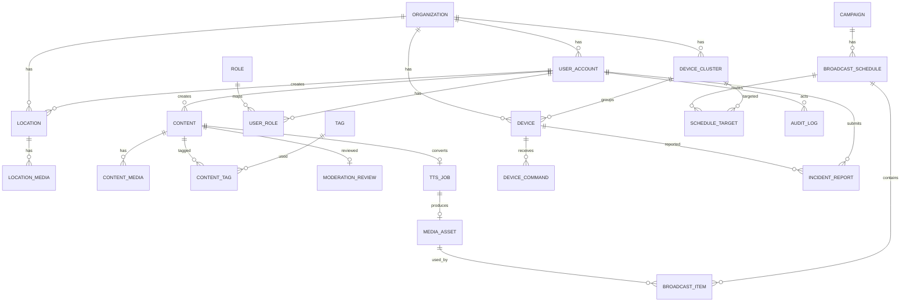
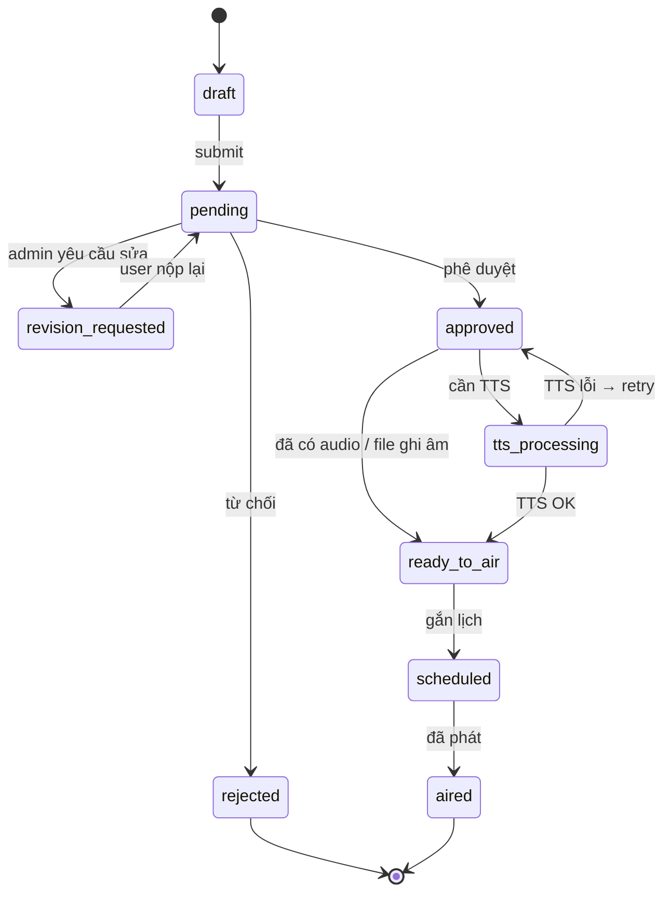

# MPCIS — Mô hình Dữ liệu

> Phiên bản: 1.0 · PostgreSQL (transactional) + MongoDB (telemetry) + Redis (realtime)

---

## 1. Sơ đồ ER tổng quan



---

## 2. PostgreSQL — Bảng nghiệp vụ

### 2.1. Tổ chức & phân quyền

#### `organizations`
Địa giới hành chính / đơn vị quản lý.

| Cột | Kiểu | Mô tả |
|-----|------|-------|
| id | UUID PK | |
| code | VARCHAR(32) UNIQUE | Mã đơn vị |
| name | VARCHAR(255) | Tên |
| type | ENUM | `province`, `district`, `commune`, `system` |
| parent_id | UUID FK NULL | Cây địa giới |
| path | VARCHAR(512) | Materialized path `/tinh/huyen/xa` |
| geo_boundary | JSONB NULL | Ranh giới GIS (optional) |
| status | ENUM | `active`, `inactive` |
| created_at / updated_at | TIMESTAMPTZ | |

#### `roles`
| Cột | Kiểu | Mô tả |
|-----|------|-------|
| id | UUID PK | |
| code | VARCHAR(64) UNIQUE | `ADMIN_SYSTEM`, `ADMIN_DISTRICT`, `USER_COMMUNE`, … |
| name | VARCHAR(128) | |
| permissions | JSONB | Danh sách permission codes |

#### `user_accounts`
| Cột | Kiểu | Mô tả |
|-----|------|-------|
| id | UUID PK | |
| username | VARCHAR(64) UNIQUE | |
| password_hash | VARCHAR(255) | |
| full_name | VARCHAR(255) | |
| phone | VARCHAR(20) | |
| email | VARCHAR(255) | |
| org_id | UUID FK | Đơn vị phụ trách |
| status | ENUM | `active`, `disabled` |
| last_login_at | TIMESTAMPTZ | |
| created_at / updated_at | TIMESTAMPTZ | |

#### `user_roles`
| Cột | Kiểu |
|-----|------|
| user_id | UUID FK |
| role_id | UUID FK |
| org_scope_id | UUID FK | Phạm vi org khi gán role |
| PK | (user_id, role_id, org_scope_id) |

---

### 2.2. Thiết bị IoT

#### `device_clusters`
Cụm phát thanh theo xã/khu vực.

| Cột | Kiểu | Mô tả |
|-----|------|-------|
| id | UUID PK | |
| org_id | UUID FK | |
| code | VARCHAR(64) | |
| name | VARCHAR(255) | |
| description | TEXT | |
| status | ENUM | `active`, `inactive` |

#### `devices`
| Cột | Kiểu | Mô tả |
|-----|------|-------|
| id | UUID PK | |
| org_id | UUID FK | |
| cluster_id | UUID FK NULL | |
| device_code | VARCHAR(64) UNIQUE | Mã quản lý |
| name | VARCHAR(255) | |
| type | ENUM | `smart_speaker`, `led_screen` |
| imei | VARCHAR(32) | |
| mac_address | VARCHAR(32) | |
| sim_iccid | VARCHAR(32) | |
| auth_type | ENUM | `cert`, `token` |
| auth_fingerprint | VARCHAR(128) | Cert fingerprint / token hash |
| lat / lng | DECIMAL(10,7) | Tọa độ GIS |
| address | VARCHAR(512) | |
| firmware_version | VARCHAR(32) | |
| volume_default | INT | 0–100 |
| status | ENUM | `active`, `maintenance`, `retired` |
| created_at / updated_at | TIMESTAMPTZ | |

#### `device_commands`
Lịch sử lệnh điều khiển.

| Cột | Kiểu | Mô tả |
|-----|------|-------|
| id | UUID PK | |
| device_id | UUID FK | |
| command_type | ENUM | `set_volume`, `reboot`, `power_on`, `power_off`, `play`, `stop`, `cache_media` |
| payload | JSONB | Tham số lệnh |
| issued_by | UUID FK | user_accounts |
| status | ENUM | `pending`, `sent`, `acked`, `failed`, `timeout` |
| mqtt_message_id | VARCHAR(64) | |
| created_at / acked_at | TIMESTAMPTZ | |

> Trạng thái online realtime lưu **Redis**: `device:{id}:online` → `{ last_seen, rssi, volume, power, … }`.

---

### 2.2b. Địa điểm / Tài sản văn hóa (GIS Asset)

Bảng `locations` phục vụ số hóa địa điểm & tài sản trên bản đồ (User Commune nhập liệu). Tách khỏi `devices` (IoT điều khiển); khi `location_type = smart_device` có thể liên kết tùy chọn tới `devices.id`.

#### Enum `location_type`
| Giá trị | Mô tả |
|---------|--------|
| `cultural_site` | Địa điểm văn hóa |
| `religious_site` | Cơ sở tín ngưỡng |
| `signboard` | Bảng vẫy / Bảng 2 chân / Bạt mái che |
| `smart_device` | Thiết bị thông minh |

> Subtype chi tiết (bảng vẫy, bảng 2 chân, bạt mái che, …) lưu ở `location_subtype` (VARCHAR hoặc ENUM phụ).

#### Enum `operation_status`
| Giá trị | Mô tả |
|---------|--------|
| `active` | Đang hoạt động |
| `inactive` | Ngừng hoạt động |
| `suspended` | Tạm đình chỉ |
| `expired` | Hết hạn giấy phép |

#### `locations`
| Cột | Kiểu | Mô tả |
|-----|------|-------|
| id | UUID PK | |
| org_id | UUID FK | Xã/phường (địa bàn quản lý) |
| province_org_id | UUID FK NULL | Tỉnh (denormalize tiện filter form) |
| created_by | UUID FK | User Commune tạo |
| name | VARCHAR(255) | Tên địa điểm / tài sản |
| location_type | ENUM | `cultural_site`, `religious_site`, `signboard`, `smart_device` |
| location_subtype | VARCHAR(64) NULL | VD: `bang_vay`, `bang_2_chan`, `bat_mai_che` |
| address | VARCHAR(512) | Địa chỉ mô tả |
| lat / lng | DECIMAL(10,7) | Tọa độ GPS (pick on map) |
| license_number | VARCHAR(128) NULL | Số giấy phép kinh doanh |
| license_conditions | TEXT NULL | Điều kiện kèm theo giấy phép |
| license_date | DATE NULL | Ngày cấp |
| expiry_date | DATE NULL | Ngày hết hạn |
| operation_status | ENUM | `active`, `inactive`, `suspended`, `expired` |
| linked_device_id | UUID FK NULL | Liên kết `devices` nếu là smart_device |
| note | TEXT NULL | Ghi chú |
| status | ENUM | `draft`, `active`, `archived` |
| created_at / updated_at | TIMESTAMPTZ | |

#### `location_media`
| Cột | Kiểu | Mô tả |
|-----|------|-------|
| id | UUID PK | |
| location_id | UUID FK | |
| storage_key | VARCHAR(512) | Ảnh hiện trạng |
| mime_type | VARCHAR(128) | |
| size_bytes | BIGINT | |
| sort_order | INT | |
| created_at | TIMESTAMPTZ | |

---

### 2.3. Nội dung & kiểm duyệt

#### `contents`
| Cột | Kiểu | Mô tả |
|-----|------|-------|
| id | UUID PK | |
| org_id | UUID FK | Địa bàn nội dung |
| author_id | UUID FK | Admin (hoặc tài khoản có `content.create`) tạo |
| title | VARCHAR(500) | |
| body_html | TEXT | Rich text |
| body_plain | TEXT | Cho TTS |
| category | ENUM | `heritage`, `festival`, `admin_notice`, `emergency`, `other` |
| status | ENUM | Xem state machine bên dưới |
| gps_lat / gps_lng | DECIMAL | Tag hiện trường |
| rejection_reason | TEXT NULL | |
| revision_note | TEXT NULL | Yêu cầu sửa |
| submitted_at / published_at | TIMESTAMPTZ | |
| created_at / updated_at | TIMESTAMPTZ | |

#### State machine `contents.status`



#### `content_media`
| Cột | Kiểu | Mô tả |
|-----|------|-------|
| id | UUID PK | |
| content_id | UUID FK | |
| media_type | ENUM | `image`, `video`, `audio_raw`, `attachment` |
| storage_key | VARCHAR(512) | |
| mime_type | VARCHAR(128) | |
| size_bytes | BIGINT | |
| duration_sec | INT NULL | |
| created_at | TIMESTAMPTZ | |

#### `tags` / `content_tags`
| `tags` | id, code, name, category |
| `content_tags` | content_id, tag_id |

#### `moderation_reviews`
| Cột | Kiểu | Mô tả |
|-----|------|-------|
| id | UUID PK | |
| content_id | UUID FK | |
| reviewer_id | UUID FK | |
| action | ENUM | `approve`, `reject`, `request_revision`, `edit` |
| note | TEXT | |
| created_at | TIMESTAMPTZ | |

---

### 2.4. TTS & Media phát sóng

#### `tts_jobs`
| Cột | Kiểu | Mô tả |
|-----|------|-------|
| id | UUID PK | |
| content_id | UUID FK | |
| voice_gender | ENUM | `male`, `female` |
| region | ENUM | `north`, `central`, `south` |
| speed | DECIMAL(3,2) | |
| bg_music_key | VARCHAR(512) NULL | |
| status | ENUM | `queued`, `processing`, `done`, `failed` |
| error_message | TEXT | |
| output_media_id | UUID FK NULL | → media_assets |
| created_by | UUID FK | |
| created_at / finished_at | TIMESTAMPTZ | |

#### `media_assets`
File sẵn sàng phát (đã ký).

| Cột | Kiểu | Mô tả |
|-----|------|-------|
| id | UUID PK | |
| storage_key | VARCHAR(512) | |
| cdn_url | VARCHAR(1024) | |
| mime_type | VARCHAR(128) | |
| duration_sec | INT | |
| checksum_sha256 | VARCHAR(64) | |
| signature | TEXT | Chữ ký số hệ thống |
| signature_alg | VARCHAR(32) | |
| source | ENUM | `tts`, `upload`, `live_clip` |
| created_at | TIMESTAMPTZ | |

---

### 2.5. Lịch phát & routing

#### `campaigns`
| Cột | Kiểu | Mô tả |
|-----|------|-------|
| id | UUID PK | |
| org_id | UUID FK | |
| name | VARCHAR(255) | |
| type | ENUM | `periodic`, `oneshot`, `emergency` |
| priority | INT | Emergency cao hơn |
| status | ENUM | `draft`, `active`, `paused`, `ended` |
| created_by | UUID FK | |

#### `broadcast_schedules`
| Cột | Kiểu | Mô tả |
|-----|------|-------|
| id | UUID PK | |
| campaign_id | UUID FK | |
| name | VARCHAR(255) | VD: Bản tin sáng |
| cron_expr | VARCHAR(64) NULL | Định kỳ |
| start_at | TIMESTAMPTZ | Lần phát / cửa sổ |
| end_at | TIMESTAMPTZ NULL | |
| timezone | VARCHAR(64) | `Asia/Ho_Chi_Minh` |
| preempt | BOOLEAN | Emergency preempt |
| status | ENUM | `scheduled`, `running`, `completed`, `cancelled`, `failed` |

#### `broadcast_items`
| Cột | Kiểu | Mô tả |
|-----|------|-------|
| id | UUID PK | |
| schedule_id | UUID FK | |
| content_id | UUID FK NULL | |
| media_asset_id | UUID FK | |
| sort_order | INT | |
| play_duration_sec | INT NULL | |

#### `schedule_targets`
Routing nội dung → cụm.

| Cột | Kiểu | Mô tả |
|-----|------|-------|
| id | UUID PK | |
| schedule_id | UUID FK | |
| cluster_id | UUID FK | |
| include | BOOLEAN | true = phát, false = loại trừ |

---

### 2.6. Sự cố & thông báo

#### `incident_reports`
| Cột | Kiểu | Mô tả |
|-----|------|-------|
| id | UUID PK | |
| device_id | UUID FK | |
| reporter_id | UUID FK | User cơ sở |
| org_id | UUID FK | |
| title | VARCHAR(255) | |
| description | TEXT | |
| photo_keys | JSONB | Danh sách ảnh |
| severity | ENUM | `low`, `medium`, `high` |
| status | ENUM | `open`, `assigned`, `in_progress`, `resolved`, `closed` |
| assignee_id | UUID FK NULL | Kỹ thuật viên |
| created_at / resolved_at | TIMESTAMPTZ | |

#### `notifications`
| Cột | Kiểu | Mô tả |
|-----|------|-------|
| id | UUID PK | |
| user_id | UUID FK | |
| channel | ENUM | `push`, `in_app`, `sms`, `zalo` |
| template_code | VARCHAR(64) | |
| title | VARCHAR(255) | |
| body | TEXT | |
| payload | JSONB | Deep link / ids |
| status | ENUM | `pending`, `sent`, `failed` |
| created_at / sent_at | TIMESTAMPTZ | |

#### `audit_logs`
| Cột | Kiểu | Mô tả |
|-----|------|-------|
| id | BIGSERIAL PK | |
| actor_id | UUID NULL | |
| actor_type | ENUM | `user`, `system`, `device` |
| action | VARCHAR(128) | `content.approve`, `device.reboot`, … |
| resource_type | VARCHAR(64) | |
| resource_id | VARCHAR(64) | |
| ip | INET | |
| user_agent | TEXT | |
| location | JSONB | lat/lng nếu có |
| before / after | JSONB | Diff |
| created_at | TIMESTAMPTZ | |

---

## 3. MongoDB — Telemetry

### Collection `device_telemetry`
```json
{
  "_id": "ObjectId",
  "device_id": "uuid",
  "org_id": "uuid",
  "ts": "ISODate",
  "online": true,
  "power": "on|off|battery",
  "voltage": 12.1,
  "temperature_c": 41.2,
  "rssi": -73,
  "volume": 70,
  "firmware": "1.2.0",
  "error_codes": [],
  "raw": {}
}
```

Index: `{ device_id: 1, ts: -1 }`, TTL optional (VD 90 ngày).

### Collection `device_play_logs`
```json
{
  "device_id": "uuid",
  "schedule_id": "uuid",
  "media_asset_id": "uuid",
  "started_at": "ISODate",
  "ended_at": "ISODate",
  "result": "ok|error|skipped_preempt",
  "error": null
}
```

---

## 4. Redis — Keys realtime

| Key pattern | Value | TTL |
|-------------|-------|-----|
| `device:{id}:presence` | JSON status | ~3× heartbeat |
| `cluster:{id}:online_count` | int | refresh |
| `schedule:{id}:lock` | worker id | khi chạy job |
| `rate:mqtt:{deviceId}` | counter | chống flood |

---

## 5. Quan hệ quyền theo địa giới (RBAC scope)

```
SYSTEM
  └── PROVINCE (org)
        └── DISTRICT (org)
              └── COMMUNE (org)
                    ├── users (USER_COMMUNE)
                    ├── clusters / devices
                    ├── locations (GIS assets)
                    └── contents (Admin / luồng phát thanh)
```

**Quy tắc đọc/ghi:**
- Admin System: toàn bộ.
- Admin District: subtree `path` của huyện.
- User Commune: chỉ org của mình — **tạo/sửa `locations`**, xem thiết bị/cluster thuộc org; không tạo content phát thanh (`content.create` không cấp cho User).

---

## 6. Chỉ số báo cáo (view / materialized)

Gợi ý bảng aggregate (hoặc view):

| Bảng/View | Metric |
|-----------|--------|
| `rpt_device_uptime_daily` | % online theo ngày/thiết bị/org |
| `rpt_broadcast_daily` | số lần phát, phút phát, theo campaign |
| `rpt_location_daily` | số location tạo/cập nhật, theo type / operation_status / org |
| `rpt_content_funnel_daily` | draft / approved / rejected / aired theo Admin/org |
| `rpt_incident_daily` | số ticket mở/đóng, MTTR |

---

## 7. Tài liệu liên quan

- [Kiến trúc Service](./01_KienTruc_Service.md)
- [10 nghiệp vụ](./nghiepvu/README.md)
