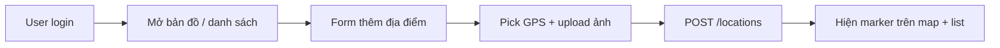
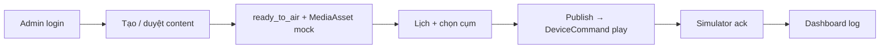

# Plan phát triển MVP Demo — MPCIS

> Mục tiêu: **ứng dụng demo chạy được** với UI đơn giản + database seed, minh họa **hai luồng cốt lõi** sau khi đổi nghiệp vụ User → GIS Asset Management.  
> Phiên bản plan: **1.1** (đồng bộ NV01/NV04/mô hình `locations`).

---

## 1. Phạm vi Demo (In / Out)

### Làm (MVP Demo)
| Hạng mục | Mô tả |
|----------|--------|
| Auth đơn giản | Login Admin / User (seed sẵn 2–3 tài khoản; User có `location.*`, không có `content.create`) |
| Admin Web | Dashboard, thiết bị IoT, soạn/duyệt nội dung phát thanh (Admin tạo), lịch phát (mock), sự cố, (optional) map thiết bị |
| User Web | Bản đồ + danh sách + form địa điểm/tài sản GIS; báo sự cố thiết bị |
| DB demo | PostgreSQL + seed: org, user, device, **location**, content (do Admin), schedule |
| API mỏng | 1 backend monolithic (không microservices thật) |
| IoT giả lập | Device simulator: heartbeat + nhận lệnh `play` (HTTP poll) |

### Không làm ở phase demo
- MQTT broker / firmware thật, TTS AI thật, SMS/Zalo, DRM, mobile native, microservices tách riêng.
- User soạn tin bài / Rich Text / submit content (đã loại khỏi NV04).

---

## 2. Stack đề xuất (giữ đơn giản)

| Lớp | Chọn | Lý do |
|-----|------|--------|
| Frontend | **Next.js (React) + Tailwind** | 1 codebase Admin + User (route theo role) |
| Backend | **Next.js API Routes** (ưu tiên) | Demo nhanh, 1 repo |
| DB | **PostgreSQL** (Docker) | Đúng kiến trúc đã mô tả |
| ORM | **Prisma** | Schema + seed rõ |
| Auth | Session/JWT credentials seed | Phân quyền demo |
| Map | **Leaflet** (User: location; Admin: device — có thể gộp layer) | Pick-on-map + tra cứu |

**Repo:**

```
mpics/
  apps/web/          # Next.js UI + API
  prisma/            # schema + seed
  scripts/device-sim/
  docs/
  docker-compose.yml
```

---

## 3. Hai Happy path Demo (không gộp thành một)

### Path A — User: Số hóa địa điểm (GIS Asset) ★ ưu tiên demo User


### Path B — Admin: Phát sóng (IoT) — nội dung do Admin tạo


**Song song:** Simulator heartbeat → device online trên Admin · User báo sự cố 1 thiết bị.

> **Lưu ý:** Không còn luồng `User tạo bài → Admin duyệt`. Content phát thanh là nghiệp vụ Admin (NV05–NV07).

---

## 4. Màn hình UI tối thiểu

### Chung
1. **Login** — Admin / User (seed)

### Admin (`/admin/...`)
2. **Dashboard** — thiết bị online, số location mới (org), lịch hôm nay, incident mở
3. **Thiết bị IoT** — bảng + lệnh giả Set volume / Reboot
4. **Nội dung phát thanh** — Admin tạo/sửa bài; queue duyệt (nếu dùng draft→approve nội bộ) → `ready_to_air`
5. **Lịch phát** — oneshot: chọn bài `ready_to_air` + cụm → Publish
6. **Sự cố** — list open → Resolve
7. *(Optional)* **Map thiết bị** — marker online/offline (NV03)

### User (`/user/...`)
8. **Bản đồ tra cứu vị trí** — marker `locations` theo xã; lọc `location_type` / `operation_status`
9. **Danh sách địa điểm/tài sản** — tên, loại, GP, hạn, tình trạng; chi tiết / sửa
10. **Form thêm địa điểm** — Tỉnh/Xã; phân loại; GP + điều kiện; ngày cấp/hết hạn; `operation_status`; **pick GPS**; upload ảnh
11. **Báo sự cố** — chọn thiết bị IoT, mô tả, (optional) ảnh

**Nguyên tắc:** layout sạch, bảng + form + map, sidebar theo role.

---

## 5. Database demo (Prisma — subset)

| Model | Dùng cho |
|-------|----------|
| Organization | Tỉnh/Huyện/Xã mẫu |
| User + Role | admin (`content.*`) / user (`location.create|update`) |
| DeviceCluster + Device | IoT Path B |
| **Location + LocationMedia** | GIS Path A (bắt buộc) |
| Content + ModerationReview | Path B — **author = Admin** |
| MediaAsset | mock sau approve |
| Campaign + BroadcastSchedule + BroadcastItem + ScheduleTarget | lịch phát |
| DeviceCommand | log lệnh |
| IncidentReport | báo sự cố |
| DevicePresence (field trên Device) | online + last_seen |

**Bỏ tạm:** Mongo telemetry raw, audit đầy đủ, TTS job thật, notification table (toast in-app).

### Seed data gợi ý
- Org: `Tỉnh Demo` → `Huyện A` → `Xã 1`, `Xã 2`
- Users: `admin` / `user.xa1` (password: `Demo@123`)
- 2 clusters, 6 devices (3 online giả lập)
- **3–5 locations** (đủ loại: signboard, religious_site, cultural_site…) kèm lat/lng
- 1 content `ready_to_air` do admin + 1 schedule mẫu (optional)

---

## 6. API Demo tối thiểu

| Method | Path | Role |
|--------|------|------|
| POST | `/api/auth/login` | public |
| GET | `/api/me` | both |
| GET/POST | `/api/locations` | user create/list (scope org); admin list rộng hơn |
| PATCH | `/api/locations/:id` | user update (scope); admin |
| GET | `/api/locations/map` | both (GeoJSON) |
| POST | `/api/media/uploads` | user (ảnh location) |
| GET/POST | `/api/contents` | **admin only** (create/list) |
| POST | `/api/contents/:id/moderate` | admin |
| GET | `/api/devices` | both (user read-only) |
| POST | `/api/devices/:id/commands` | admin |
| POST | `/api/schedules` | admin |
| POST | `/api/schedules/:id/publish` | admin |
| POST | `/api/incidents` | user |
| PATCH | `/api/incidents/:id` | admin |
| POST | `/api/sim/heartbeat` | simulator |
| GET | `/api/sim/commands?device_id=` | simulator poll |

> Demo **poll HTTP** thay MQTT. **Không** có `POST /api/contents` cho User.

---

## 7. Lộ trình theo tuần

### Tuần 1 — Nền tảng + GIS User
- [ ] Docker Compose Postgres
- [ ] Prisma schema (+ `Location`) + migrate + seed
- [ ] Next.js: login + layout Admin/User
- [ ] User: map + list + form tạo location (pick GPS + ảnh)
- [ ] Admin: xem list devices / locations (read)

**Milestone:** User tạo địa điểm → thấy trên map & list.

### Tuần 2 — Phát sóng Admin + Simulator
- [ ] Admin: CRUD content → `ready_to_air` (MediaAsset mock; bỏ TTS thật)
- [ ] Admin: lịch + target cụm → publish → `DeviceCommand`
- [ ] Device simulator: heartbeat + poll `play` → ack
- [ ] Dashboard số liệu từ DB

**Milestone:** Path A + Path B chạy local.

### Tuần 3 — Bổ sung (nếu còn time)
- [ ] Báo sự cố + resolve
- [ ] Admin map thiết bị (layer riêng hoặc gộp)
- [ ] `location.update` + lọc map theo type/status
- [ ] Volume/reboot log lệnh
- [ ] README 1 lệnh chạy demo

**Milestone:** Walkthrough 10–15 phút đủ 2 path.

---

## 8. Thứ tự code khuyến nghị

```
1. docker-compose + Prisma schema/seed (Location + Device + Content)
2. Auth + middleware /admin /user + permissions
3. User: locations CRUD + map pick + GeoJSON
4. Admin: devices list + commands stub
5. Admin: contents + moderate (nội bộ) + schedules publish
6. scripts/device-sim.ts
7. Dashboard widgets (cả location count + device online)
8. Incidents
9. (Optional) Admin device map layer
```

---

## 9. Tiêu chí “Demo xong”

1. `docker compose up -d && pnpm db:seed && pnpm dev` chạy được.
2. **Path A:** User tạo location (form + GPS + ảnh) → hiện map/list.
3. **Path B:** Admin content → lịch → simulator play → dashboard có log.
4. User **không** tạo được content (API/UI chặn).
5. README tiếng Việt: tài khoản seed, URL màn hình, cách chạy simulator.

---

## 10. Rủi ro & cách giữ đơn giản

| Rủi ro | Cách tránh |
|--------|------------|
| Nhầm User còn soạn bài | UI/API User chỉ `locations` + incidents |
| Trùng map NV03 vs NV04 | User map = **locations**; Admin map = **devices** (+ optional overlay) |
| Làm microservices sớm | 1 app Next.js + Prisma |
| MQTT phức tạp | HTTP poll simulator |
| TTS/AI | Admin approve = media mock URL |
| Scope creep report/analytics | Ngoài MVP |

---

## 11. Bước tiếp theo ngay

1. Khởi tạo Next.js + Docker Postgres + Prisma (`Location` + seed)  
2. Login + layout + **Path A** (User GIS)  
3. **Path B** Admin phát sóng + simulator  

Bạn muốn bắt đầu code phase Tuần 1 không?
