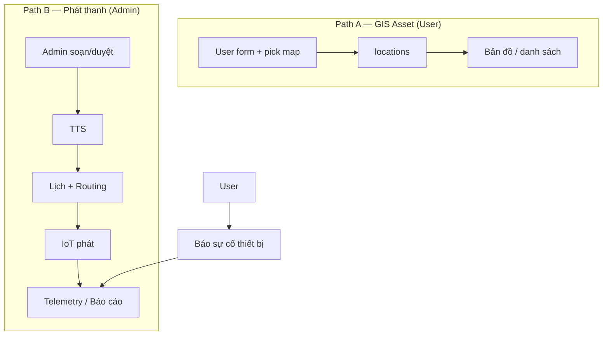

# MPCIS — Bộ tài liệu kiến trúc

Tài liệu thiết kế kỹ thuật cho **MobiFone Public Communication & Information System**.

> **Cập nhật nghiệp vụ User:** từ “soạn tin bài” → **Số hóa & quản lý địa điểm/tài sản trên GIS** (xem NV04, plan MVP 1.1).

## Mục lục

| # | Tài liệu | Mô tả |
|---|----------|-------|
| 0 | [Đặc tả gốc](./MPCIS_HeThongQuanLyVanHoa_ChiTiet.md) | Tổng quan nghiệp vụ & yêu cầu (đã chỉnh User GIS) |
| 1 | [Sơ đồ kiến trúc / Service](./01_KienTruc_Service.md) | Context, microservices (có `location-service`), MQTT |
| 2 | [Mô hình dữ liệu](./02_MoHinhDuLieu.md) | ER, `locations`, PostgreSQL, MongoDB, Redis |
| 3 | [Plan MVP Demo](./03_Plan_MVP_Demo.md) | UI + DB seed + 2 happy path |
| 4 | [Tiến độ & lộ trình sản xuất](./04_TienDo_Va_Roadmap_SanXuat.md) | Demo OK · P0→P3 production |
| 5 | [Checklist staging](./05_Staging_Checklist.md) | Deploy staging nội bộ |
| 6 | [10 nghiệp vụ cơ bản](./nghiepvu/README.md) | Chi tiết từng domain |

## 10 nghiệp vụ

1. Auth / RBAC  
2. Quản lý thiết bị IoT  
3. Giám sát GIS **thiết bị** (Admin)  
4. Số hóa địa điểm / tài sản GIS (**User**)  
5. Kiểm duyệt / soạn nội dung phát thanh (**Admin**)  
6. AI TTS  
7. Lập lịch & phát sóng  
8. Routing theo cụm  
9. Telemetry & cảnh báo  
10. Sự cố & báo cáo  

## Hai luồng end-to-end

