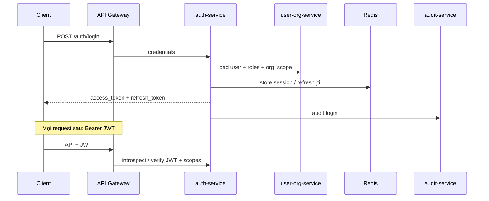

# NV01 — Xác thực & Phân quyền (Auth / RBAC)

## 1. Mục tiêu
Đăng nhập an toàn; gán quyền theo **vai trò + địa giới hành chính**; đảm bảo Admin/User chỉ thao tác đúng phạm vi org.

## 2. Actor
| Actor | Việc làm |
|-------|----------|
| Admin System | Quản lý toàn hệ thống, cấp tài khoản |
| Admin District/Province | Quản lý subtree địa giới |
| User Commune | Đăng nhập app, thao tác trong xã |

## 3. Services liên quan
`auth-service` · `user-org-service` · `audit-service` · `notification-service`

## 4. Kiến trúc luồng

## 5. Permission model (ví dụ)

| Permission | Admin System | Admin District | User Commune |
|------------|:---:|:---:|:---:|
| `user.manage` | ✓ | ✓ (subtree) | |
| `device.control` | ✓ | ✓ | |
| `device.view` | ✓ | ✓ | ✓ (org) |
| `content.create` | ✓ | ✓ | |
| `content.moderate` | ✓ | ✓ | |
| `location.create` | ✓ | ✓ | ✓ (org) |
| `location.update` | ✓ | ✓ | ✓ (org) |
| `schedule.manage` | ✓ | ✓ | |
| `incident.create` | ✓ | ✓ | ✓ |
| `report.view` | ✓ | ✓ | giới hạn |

JWT claims gợi ý: `sub`, `roles[]`, `org_id`, `org_path`, `permissions[]`.

## 6. API chính
- `POST /api/v1/auth/login`
- `POST /api/v1/auth/refresh`
- `POST /api/v1/auth/logout`
- `CRUD /api/v1/users`
- `CRUD /api/v1/roles`
- `POST /api/v1/users/{id}/roles`

## 7. Dữ liệu
`user_accounts`, `roles`, `user_roles`, `organizations`, `audit_logs`

## 8. Bảo mật
- Mật khẩu hash (bcrypt/argon2); lock sau N lần sai.
- Refresh token rotation; revoke qua Redis denylist.
- Mọi thay đổi role/org ghi audit.

## 9. Tiêu chí chấp nhận
- [ ] User xã không gọi được API `device.control`.
- [ ] User xã có `location.create` / `location.update` trong phạm vi org; không còn `content.create`.
- [ ] Admin huyện không thấy thiết bị ngoài subtree.
- [ ] Disable user → token bị từ chối trong ≤ 1 phút (hoặc ngay nếu dùng short-lived access + denylist).
