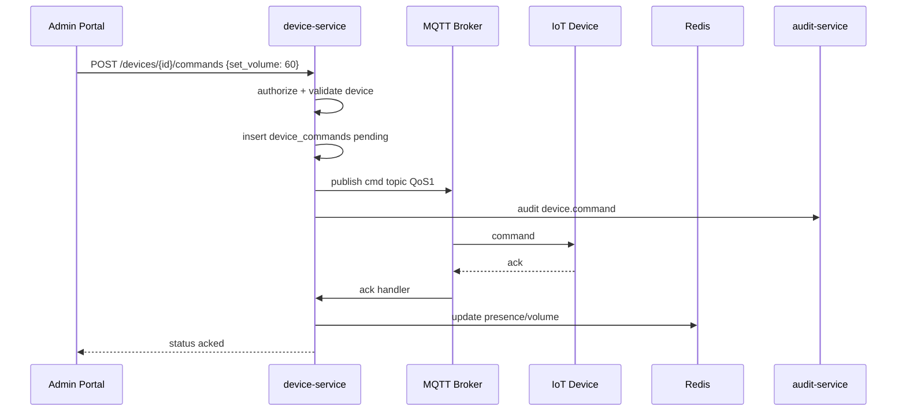

# NV02 — Quản lý & Điều khiển Thiết bị IoT

## 1. Mục tiêu
Đăng ký, giám sát trạng thái, điều khiển từ xa (volume, reboot, power) từng thiết bị hoặc theo cụm.

## 2. Actor
Admin (điều khiển) · User (chỉ xem thiết bị địa bàn).

## 3. Services
`device-service` · `telemetry-service` · `routing-service` (cluster) · MQTT Broker · `audit-service`

## 4. Kiến trúc luồng

## 5. Lệnh hỗ trợ
| command_type | Payload |
|--------------|---------|
| `set_volume` | `{ "volume": 0-100 }` |
| `reboot` | `{}` |
| `power_on` / `power_off` | `{}` |
| `cache_media` | `{ "media_url", "signature", "asset_id" }` |
| `play` / `stop` | schedule/media refs |

## 6. API chính
- `CRUD /api/v1/devices`
- `CRUD /api/v1/clusters`
- `GET /api/v1/devices/{id}/status`
- `POST /api/v1/devices/{id}/commands`
- `POST /api/v1/clusters/{id}/commands` (broadcast lệnh)
- `GET /api/v1/devices/{id}/commands` (lịch sử)

## 7. MQTT topics
- `mpcis/{orgId}/device/{deviceId}/cmd`
- `mpcis/{orgId}/device/{deviceId}/ack`
- `mpcis/{orgId}/cluster/{clusterId}/cmd`

## 8. Device auth
- Kết nối MQTTS bằng client certificate **hoặc** token gắn IMEI/MAC.
- Broker ACL: device chỉ pub/sub đúng topic của mình.

## 9. Tiêu chí chấp nhận
- [x] Lệnh volume 1 loa tạo command pending (ack phụ thuộc sim/MQTT).
- [x] Lệnh theo cụm (`POST /api/clusters/{id}/commands`) gửi mọi device active trong cụm.
- [x] User không thể gọi command API (`canControlDevice` Admin-only).
- [x] Timeout lệnh → status `timeout` + hiển thị Admin IoT.
- [x] CRUD cụm / thiết bị (Admin).
