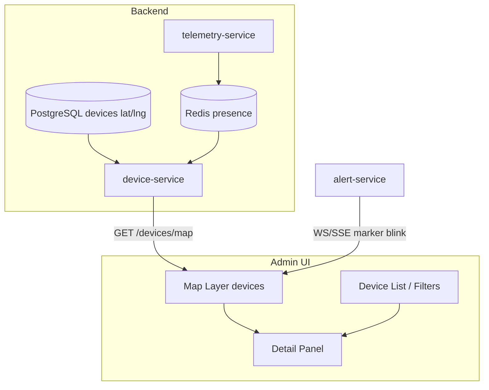

# NV03 — Giám sát GIS Thiết bị IoT (Bản đồ số)

## 1. Mục tiêu
Hiển thị vị trí thực **thiết bị IoT** (loa/LED) trên bản đồ; lọc theo org/cụm/trạng thái; cảnh báo trực quan khi offline/lỗi.

> **Không nhầm với NV04:** NV03 = layer **`devices`** (Admin vận hành). NV04 = layer **`locations`** (User số hóa địa điểm/tài sản).

## 2. Actor
Admin Portal (chính). User App **không** dùng màn này để nhập địa điểm — User dùng NV04.

## 3. Services
`device-service` · `telemetry-service` · `alert-service` · Frontend map (Leaflet/Mapbox)

## 4. Kiến trúc luồng

## 5. API chính
- `GET /api/v1/devices/map?org_id=&status=&type=` → GeoJSON FeatureCollection
- `GET /api/v1/devices/{id}` — chi tiết + last telemetry
- `GET /api/v1/clusters/{id}/bounds`
- WebSocket/SSE: `/api/v1/stream/device-events` (online/offline/alert)

## 6. Lớp hiển thị bản đồ
| Layer | Nội dung |
|-------|----------|
| Markers | Loa / LED theo icon + màu trạng thái |
| Clusters | Gom nhóm khi zoom nhỏ |
| Admin boundary | Overlay địa giới (optional) |
| Alert pulse | Thiết bị offline / incident mở |
| *(Optional overlay)* | `locations` read-only — chỉ khi Admin cần xem cùng khung; API vẫn tách |

Màu gợi ý: xanh = online, xám = offline, đỏ = lỗi/mất điện, vàng = maintenance.

## 7. Dữ liệu
- Tọa độ: `devices.lat/lng`
- Presence realtime: Redis
- Cảnh báo: `alert-service` events

## 8. Tiêu chí chấp nhận
- [ ] Map tải ≥ 1.000 device markers có clustering mượt.
- [ ] Đổi trạng thái offline phản ánh trên map ≤ 15s sau khi detect.
- [ ] Click marker → panel: RSSI, volume, last seen, lệnh nhanh (Admin).
- [ ] Không dùng API `/locations` để thay thế giám sát thiết bị.
