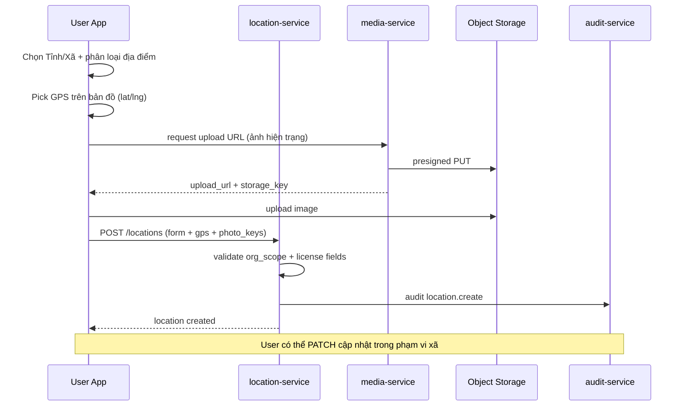

# NV04 — Số hóa & Quản lý Địa điểm/Tài sản (User)

## 1. Mục tiêu
Cán bộ cơ sở **thu thập, số hóa và quản lý địa điểm/tài sản văn hóa** trên nền tảng bản đồ (GIS Asset Management): nhập biểu mẫu địa điểm/thiết bị, chọn tọa độ GPS trên map, upload ảnh hiện trạng; quản lý trong phạm vi xã được phân quyền.

## 2. Actor
User Commune (Mobile App / Web tinh gọn).

## 3. Services
`location-service` · `media-service` · `user-org-service` · `notification-service` · `audit-service`

## 4. Kiến trúc luồng

## 5. Chức năng UI
- **Form thêm mới địa điểm/thiết bị** (không dùng Rich Text Editor / soạn tin bài / đính kèm audio):
  - Chọn **Tỉnh / Xã** (theo cây `organizations`, scope User).
  - **Phân loại địa điểm** (`location_type` / subtype): Bảng vẫy, Bảng 2 chân, Bạt mái che, Cơ sở tín ngưỡng, Địa điểm văn hóa, Thiết bị thông minh, …
  - **Thông tin giấy phép:** Số giấy phép kinh doanh, điều kiện (ghi chú điều kiện kèm theo).
  - **Ngày cấp**, **Ngày hết hạn**, **Tình trạng hoạt động** (`operation_status`).
- **Pick on map:** chọn tọa độ GPS trực tiếp trên bản đồ (marker kéo/thả hoặc click); hiển thị lat/lng trên form.
- **Upload hình ảnh thực tế** của địa điểm (1 hoặc nhiều ảnh hiện trạng).
- Danh sách địa điểm/tài sản trong phạm vi xã; xem chi tiết trên map.
- (Optional) Chỉnh sửa thông tin địa điểm đã tạo (`location.update`).

## 6. API chính
- `POST /api/v1/locations`
- `PATCH /api/v1/locations/{id}`
- `GET /api/v1/locations?org_id=&location_type=&operation_status=`
- `GET /api/v1/locations/{id}`
- `GET /api/v1/locations/map?org_id=` → GeoJSON FeatureCollection
- `POST /api/v1/media/uploads` (presign ảnh địa điểm)
- `POST /api/v1/locations/{id}/media`

## 7. Validation
- Bắt buộc: `name`, `org_id` (xã) khớp scope User, `location_type`, `lat`/`lng`, `operation_status`.
- Giấy phép: `license_number`, `license_date`, `expiry_date` bắt buộc với loại cần cấp phép (VD `signboard`); `expiry_date` ≥ `license_date`.
- Giới hạn dung lượng/số lượng ảnh theo cấu hình.
- User chỉ tạo/sửa location thuộc `org_id` (và subtree được phép) của mình.

## 8. Tiêu chí chấp nhận
- [ ] Tạo địa điểm bằng form + pick GPS trên map + upload ảnh hiện trạng thành công.
- [ ] Dữ liệu lưu đủ: phân loại, giấy phép, ngày cấp/hết hạn, tình trạng hoạt động, tọa độ.
- [ ] User không gọi được API ngoài scope xã; không có luồng soạn tin bài / Rich Text / audio trên User App.
