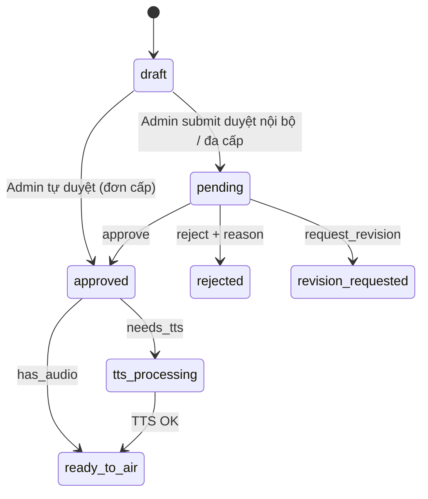
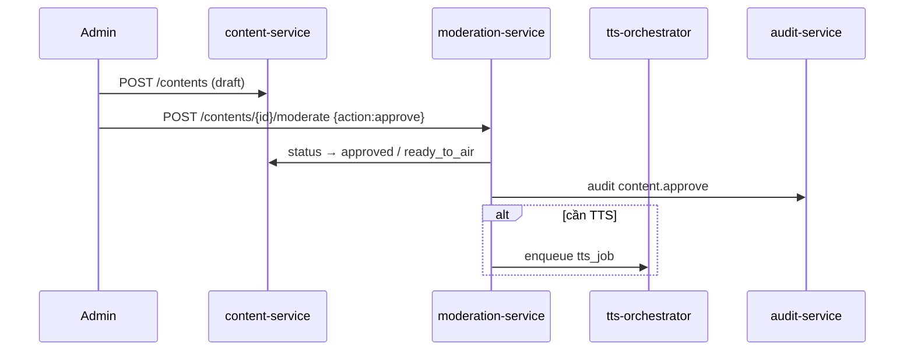

# NV05 — Soạn & Kiểm duyệt Nội dung Phát thanh (Admin)

## 1. Mục tiêu
Admin **tạo / chỉnh sửa / phê duyệt** tin bài phục vụ phát thanh cơ sở; gắn tag/phân loại; chuẩn bị đưa sang TTS (NV06) và lịch phát (NV07).

> **Thay đổi so với bản cũ:** Nội dung **không** còn do User Commune nộp từ NV04. User chỉ quản lý `locations` (GIS Asset). Author của `contents` là Admin (hoặc hệ thống import).

## 2. Actor
Admin District / Province / System.

## 3. Services
`moderation-service` · `content-service` · `tts-orchestrator` · `notification-service` · `audit-service`

## 4. Kiến trúc luồng

## 5. Actions
| Action | Kết quả |
|--------|---------|
| `create` / `edit` | Admin soạn title, body_plain/html, category |
| `approve` | → `approved` (+ optional TTS) |
| `reject` | → `rejected` + `rejection_reason` |
| `request_revision` | → `revision_requested` (nếu có quy trình đa cấp Admin) |

## 6. Phân loại / tagging
Categories: `heritage`, `festival`, `admin_notice`, `emergency`, `other` + free tags.

## 7. API chính
- `GET/POST /api/v1/contents` — **Admin** (User không có `content.create`)
- `POST /api/v1/contents/{id}/moderate`
- `PUT /api/v1/contents/{id}/tags`
- `GET /api/v1/contents/{id}/reviews`

## 8. Quy tắc
- Chỉ user có `content.create` / `content.moderate` trong scope org.
- Emergency content ưu tiên queue.
- Không phát sóng trực tiếp từ bước này — phải qua NV06/NV07.

## 9. Tiêu chí chấp nhận
- [ ] Admin tạo và duyệt bài → `ready_to_air` (hoặc TTS) thành công.
- [ ] User Commune gọi `POST /contents` → 403.
- [ ] Mọi action có `moderation_reviews` + audit.
