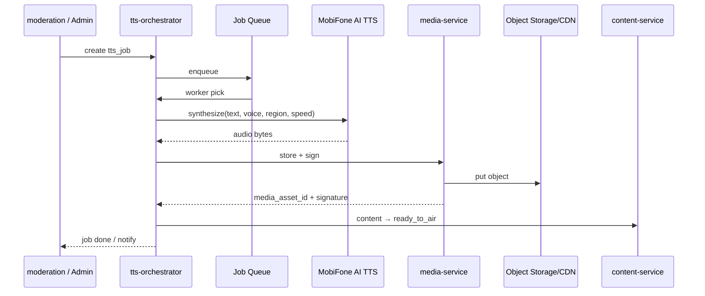

# NV06 — AI Text-to-Speech (MobiFone AI)

## 1. Mục tiêu
Chuyển văn bản đã duyệt thành audio MP3 với giọng Nam/Nữ, vùng miền Bắc/Trung/Nam, tốc độ đọc, nhạc nền; lưu CDN + chữ ký số.

## 2. Actor
Admin (cấu hình & trigger) · Hệ thống (tự enqueue sau approve).

## 3. Services
`tts-orchestrator` · MobiFone AI Engine · `media-service` · `content-service` · `notification-service`

## 4. Kiến trúc luồng

## 5. Tham số cấu hình
| Param | Giá trị |
|-------|---------|
| `voice_gender` | male / female |
| `region` | north / central / south |
| `speed` | 0.8 – 1.5 |
| `bg_music_key` | optional storage key |
| Preview | Admin nghe thử trước khi gắn lịch (khuyến nghị) |

## 6. API chính
- `POST /api/v1/tts/jobs` `{ content_id, voice_gender, region, speed, bg_music_key }`
- `GET /api/v1/tts/jobs/{id}`
- `POST /api/v1/tts/jobs/{id}/retry`
- `GET /api/v1/media/assets/{id}/preview-url` (signed, short TTL)

## 7. Lỗi & retry
- AI timeout/fail → `tts_jobs.status=failed`; content giữ `approved` hoặc `tts_processing` với retry.
- Max retry có cấu hình; sau đó báo Admin.

## 8. Bảo mật
- Chỉ text đã `approved` mới được TTS để phát sóng.
- Output bắt buộc qua `media-service` ký số trước khi `ready_to_air`.

## 9. Tiêu chí chấp nhận
- [ ] TTS xong tạo `media_assets` có checksum + signature.
- [ ] Content chuyển `ready_to_air`.
- [ ] Admin preview được file trước khi schedule.
- [ ] Job fail không làm mất nội dung gốc.
