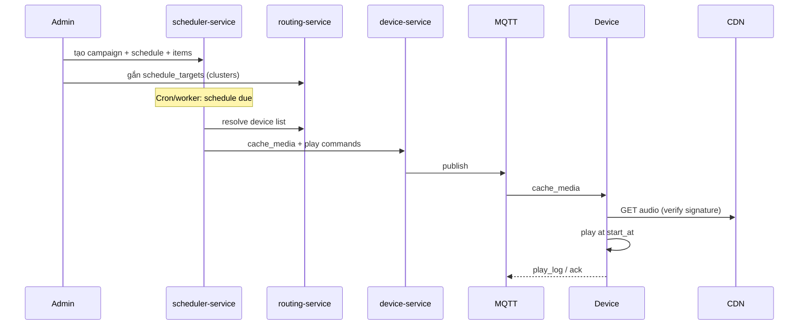

# NV07 — Lập lịch & Phát sóng

## 1. Mục tiêu
Tạo chiến dịch/lịch định kỳ hoặc phát ngay (emergency); tới giờ đẩy lệnh cache/play xuống thiết bị đích; ghi nhận kết quả phát.

## 2. Actor
Admin · Scheduler worker · IoT devices.

## 3. Services
`scheduler-service` · `routing-service` · `device-service` · `media-service` · MQTT · `telemetry-service` (play logs) · `audit-service`

## 4. Kiến trúc luồng

## 5. Loại chiến dịch
| Type | Mô tả |
|------|-------|
| `periodic` | Cron (VD 06:00, 17:00 hàng ngày) |
| `oneshot` | Một lần theo `start_at` |
| `emergency` | Phát ngay, `preempt=true`, priority cao |

### Preemption
Khi emergency chạy: gửi `stop` lịch thường trên cùng device → phát emergency → (optional) resume theo policy.

## 6. API chính
- `CRUD /api/v1/campaigns`
- `CRUD /api/v1/schedules`
- `POST /api/v1/schedules/{id}/items`
- `POST /api/v1/schedules/{id}/targets` (xem NV08)
- `POST /api/v1/schedules/{id}/publish` — kích hoạt
- `POST /api/v1/schedules/{id}/cancel`
- `POST /api/v1/schedules/emergency` — shortcut phát ngay

## 7. Đồng bộ thời gian & cache
- Device NTP `Asia/Ho_Chi_Minh`.
- Pre-cache media **trước X phút** (cấu hình, VD 10–15 phút).
- Idempotent `play` theo `schedule_id` + `item_id` (tránh phát trùng khi MQTT redelivery).

## 8. Dữ liệu
`campaigns`, `broadcast_schedules`, `broadcast_items`, `schedule_targets`, `device_commands`, Mongo `device_play_logs`

## 9. Tiêu chí chấp nhận
- [ ] Lịch định kỳ tạo đúng các lần chạy.
- [ ] Emergency preempt lịch đang phát.
- [ ] Device từ chối file không đúng chữ ký.
- [ ] Play log ghi nhận ok/error theo thiết bị.
