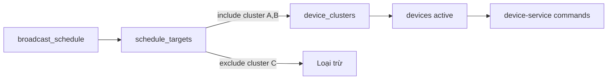

# NV08 — Routing Nội dung theo Cụm / Địa bàn

## 1. Mục tiêu
Chỉ định lịch phát đến đúng cụm loa/LED (VD chỉ xã A nhận bản tin nông nghiệp); hỗ trợ include/exclude theo cluster.

## 2. Actor
Admin khi lập lịch · `routing-service` khi resolve thiết bị lúc phát.

## 3. Services
`routing-service` · `scheduler-service` · `device-service` · `user-org-service` (scope)

## 4. Kiến trúc luồng



### Thuật toán resolve
1. Lấy tất cả `schedule_targets` của schedule.
2. Tập include = union devices thuộc các cluster `include=true`.
3. Trừ devices thuộc cluster `include=false`.
4. Lọc `devices.status=active` và (optional) online-only policy.
5. Trả danh sách `device_id[]` cho scheduler.

## 5. API chính
- `PUT /api/v1/schedules/{id}/targets`
  ```json
  {
    "targets": [
      { "cluster_id": "...", "include": true },
      { "cluster_id": "...", "include": false }
    ]
  }
  ```
- `GET /api/v1/schedules/{id}/resolved-devices` — preview trước khi publish
- `GET /api/v1/orgs/{id}/clusters`

## 6. Quy tắc nghiệp vụ
- Ít nhất 1 target include khi publish schedule.
- Target phải thuộc org_scope của Admin.
- Emergency vẫn đi qua routing (có thể chọn “toàn huyện”).

## 7. UI gợi ý
- Chọn trên map/cây địa giới → map sang clusters.
- Preview số thiết bị sẽ nhận sóng trước khi lưu.

## 8. Tiêu chí chấp nhận
- [x] Bản tin resolve theo include/exclude clusters (`lib/routing` + publish).
- [x] Exclude loại đúng thiết bị.
- [x] Preview `GET /api/schedules/{id}/resolved-devices` khớp thuật toán publish.
- [x] Verified bằng play_log khi ack `play` (`DevicePlayLog` + `/api/reports/broadcasts`).
