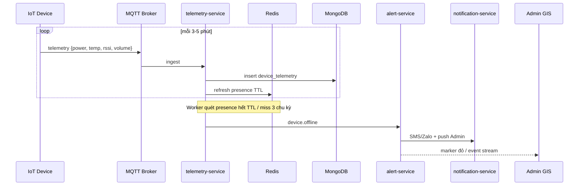

# NV09 — Telemetry & Cảnh báo Thiết bị

## 1. Mục tiêu
Thu heartbeat 3–5 phút; cập nhật presence; đánh dấu offline sau 3 chu kỳ mất tín hiệu; cảnh báo GIS + SMS/Zalo tới kỹ thuật viên.

## 2. Actor
Thiết bị IoT · `telemetry-service` · Admin (xem) · Kỹ thuật viên (nhận ZNS/SMS).

## 3. Services
MQTT Broker · `telemetry-service` · `device-service` · `alert-service` · `notification-service` · Redis · MongoDB

## 4. Kiến trúc luồng



## 5. Payload telemetry (ví dụ)
```json
{
  "device_id": "uuid",
  "ts": 1730000000,
  "power": "on",
  "temperature_c": 42.0,
  "rssi": -80,
  "volume": 65,
  "error_codes": []
}
```

## 6. Rule cảnh báo (mặc định)
| Rule | Điều kiện | Severity |
|------|-----------|----------|
| Offline | Miss ≥ 3 heartbeat | high |
| Mất điện | `power=off` hoặc voltage thấp | high |
| Nhiệt độ cao | temp > ngưỡng | medium |
| Sóng yếu | rssi < ngưỡng kéo dài | low |
| Lỗi linh kiện | error_codes ≠ ∅ | medium/high |

Anti-storm: gom alert theo org trong cửa sổ thời gian (debounce).

## 7. API chính
- `GET /api/v1/devices/{id}/telemetry?from=&to=`
- `GET /api/v1/alerts?status=open`
- `POST /api/v1/alerts/{id}/ack`
- Internal: MQTT subscribe `.../telemetry`

## 8. Tiêu chí chấp nhận
- [x] Offline detect sau `DEVICE_OFFLINE_MINUTES` (mặc định 15) qua `jobs:run` / cron tick.
- [x] Alert tạo 1 lần (không spam) cho đến khi recover/ack/resolve — hiện trên `/admin/iot`.
- [ ] ZNS/SMS gửi đúng kỹ thuật viên phụ trách org.
- [x] Recover online → auto-resolve alert offline.
