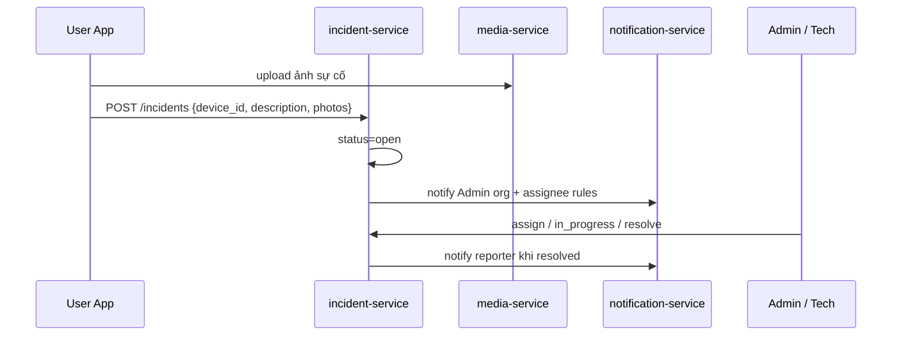
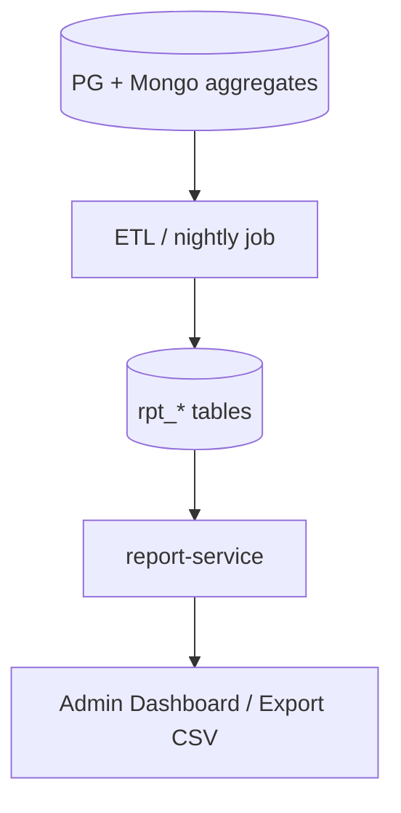

# NV10 — Báo sự cố & Báo cáo Thống kê

## 1. Mục tiêu
(1) User báo sự cố hiện trường (ảnh, mô tả) → Admin/KT xử lý ticket.  
(2) Xuất báo cáo: tỷ lệ thiết bị hoạt động, tần suất/thời lượng phát, số liệu địa điểm GIS theo khu vực.

## 2. Actor
User (tạo incident) · Admin / Kỹ thuật viên (xử lý) · Lãnh đạo (xem report).

## 3. Services
`incident-service` · `notification-service` · `report-service` · `device-service` · `media-service` · `audit-service`

## 4A. Luồng báo sự cố

### API Incident
- `POST /api/v1/incidents`
- `GET /api/v1/incidents?org_id=&status=`
- `PATCH /api/v1/incidents/{id}` — assign, status, note
- `POST /api/v1/incidents/{id}/comments`

### State
`open` → `assigned` → `in_progress` → `resolved` → `closed`

## 4B. Luồng báo cáo thống kê

### Báo cáo chuẩn
| Report | Nội dung | Dimension |
|--------|----------|-----------|
| Device uptime | % online, số lần offline | ngày, org, cluster, device |
| Broadcast | số lần phát, phút phát, success rate | ngày, campaign, cluster |
| Location GIS | số tạo/cập nhật, theo type / operation_status | ngày, org |
| Content funnel | draft / duyệt / từ chối / aired (Admin) | ngày, org, author |
| Incident | số ticket, MTTR, theo severity | ngày, org |

### API Report
- `GET /api/v1/reports/device-uptime?from=&to=&org_id=`
- `GET /api/v1/reports/broadcasts?...`
- `GET /api/v1/reports/locations?...`
- `GET /api/v1/reports/content-funnel?...`
- `GET /api/v1/reports/incidents?...`
- `GET /api/v1/reports/export?type=&format=csv`

## 5. Phân quyền
- User: tạo incident + xem incident của mình / org mình.
- Admin: xem & xử lý trong scope; xem report scope.
- Không lộ dữ liệu ngoài `org_path`.

## 6. Tiêu chí chấp nhận
- [ ] User gửi báo lỗi kèm ảnh → Admin thấy trong < 1 phút.
- [ ] Resolve gửi notify cho reporter.
- [ ] Report uptime khớp gần đúng với telemetry (sai số TTL chấp nhận được).
- [ ] Export CSV đúng filter thời gian/org.
