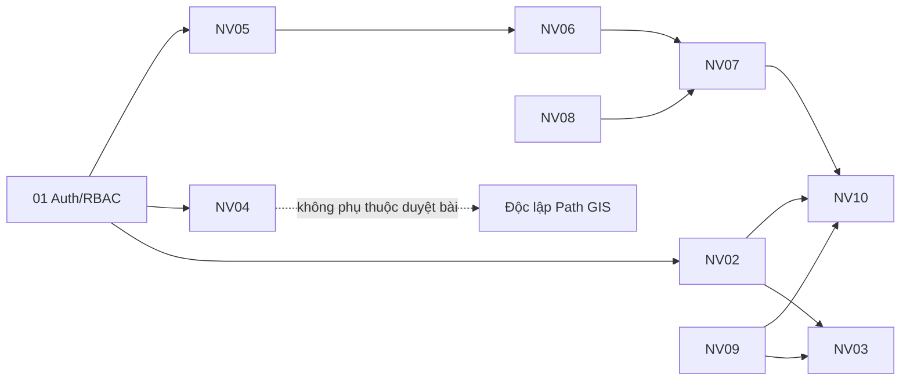

# 10 Nghiệp vụ cơ bản MPCIS

Mỗi tài liệu mô tả: mục tiêu, actor, services, luồng, API chính, sự kiện, dữ liệu, bảo mật, tiêu chí chấp nhận.

| # | Tài liệu | Nghiệp vụ |
|---|----------|-----------|
| 01 | [NV01_Auth_RBAC.md](./NV01_Auth_RBAC.md) | Xác thực & phân quyền theo địa giới |
| 02 | [NV02_QuanLyThietBi.md](./NV02_QuanLyThietBi.md) | Quản lý & điều khiển thiết bị IoT |
| 03 | [NV03_GIS_GiamSat.md](./NV03_GIS_GiamSat.md) | Giám sát GIS **thiết bị IoT** (Admin) |
| 04 | [NV04_ThuThapNoiDung.md](./NV04_ThuThapNoiDung.md) | User số hóa & quản lý địa điểm/tài sản (GIS Asset) |
| 05 | [NV05_KiemDuyetNoiDung.md](./NV05_KiemDuyetNoiDung.md) | Admin soạn / kiểm duyệt tin phát thanh |
| 06 | [NV06_TTS_AI.md](./NV06_TTS_AI.md) | AI Text-to-Speech |
| 07 | [NV07_LapLichPhatSong.md](./NV07_LapLichPhatSong.md) | Lập lịch & phát sóng |
| 08 | [NV08_RoutingNoiDung.md](./NV08_RoutingNoiDung.md) | Routing nội dung theo cụm/địa bàn |
| 09 | [NV09_TelemetryCanhBao.md](./NV09_TelemetryCanhBao.md) | Telemetry & cảnh báo thiết bị |
| 10 | [NV10_SuCo_BaoCao.md](./NV10_SuCo_BaoCao.md) | Báo sự cố & báo cáo thống kê |

## Phân tách bản đồ (tránh trùng NV03 / NV04)

| Nghiệp vụ | Đối tượng trên map | Actor chính |
|-----------|-------------------|-------------|
| **NV03** | `devices` (loa/LED) + trạng thái realtime | Admin |
| **NV04** | `locations` (địa điểm/tài sản văn hóa, biển hiệu…) | User Commune |

Có thể dùng chung thư viện map; **khác layer / API** (`/devices/map` vs `/locations/map`).

## Sơ đồ phụ thuộc nghiệp vụ

> **Đã bỏ** cạnh `NV04 → NV05`: User không còn nộp tin bài để Admin duyệt.
